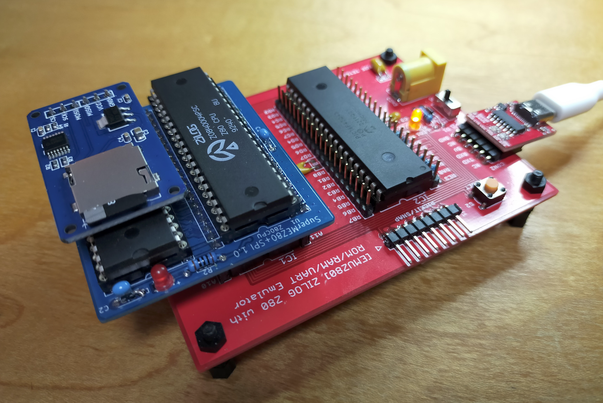
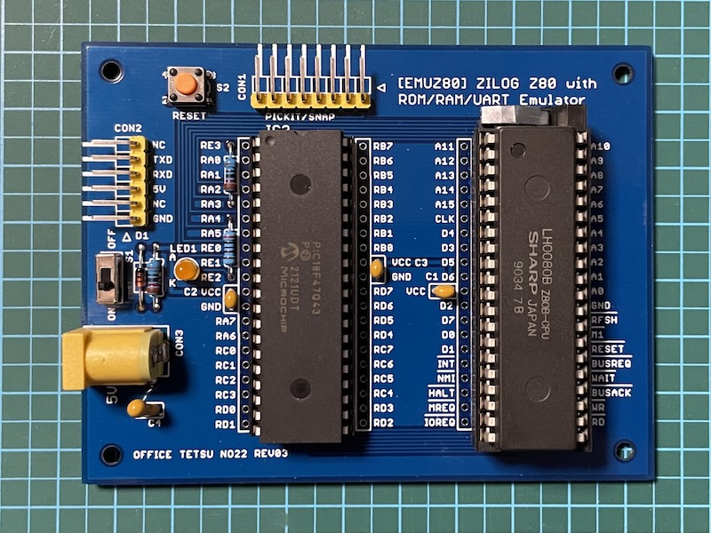
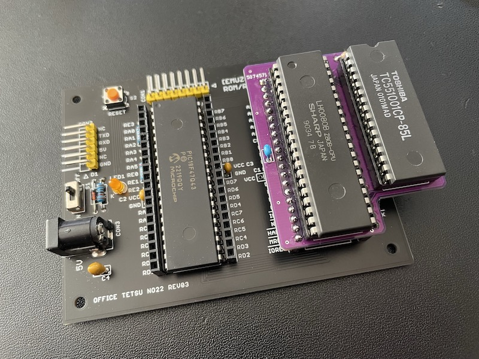

# Firmware for SuperMEZ80-SPI

EMUZ80用のメザニンボードSuperMEZ80-SPI用のファームウェアです。
Satoshi Okueさん(@S_Okue)さんのSuperMEZ80にSPIインターフェースのmicro SD Card slotなどを追加して
EMUZ80でCP/Mを動作させることができます。

Zilog Z0840004PSCとPIC18F47Q43の組み合わせで動作確認しています。

## 特徴

* z80pack(https://github.com/udo-munk/z80pack) のSIMとある程度互換性のあるI/Oを実装しているため、
z80packのCP/Mのディスクイメージを起動することができます。  
（全てのI/Oが実装されているわけではありません）
* SuperMEZ80同様に、RAMの制御信号とIOアクセスのWAIT信号をPICのCLC(Configurable Logic Cell)機能で作成しています。
* SuperMEZ80ではPICとSRAMのA14が接続されていますが、これを諦めて代わりにSPIの/CSに使用することにより、I/O expander (MCP23S08)を接続しています。SPIのMOSI/MISO/SCKはZ80のデータバスと共用です。
* I/O expanderからZ80の/NMIに接続しています。PICからZ80に割り込みをかけることができます。

  
Z80 Single-Board Computer EMUZ80 と SuperMEZ80-SPI

## メザニンボード
https://github.com/hanyazou/SuperMEZ80-SPI

## 回路図
https://github.com/hanyazou/SuperMEZ80-SPI/schematic.pdf

## ファームウェア

* macOSかLinuxでビルドできます
* PIC18用のコンパイラ(XC8)を使います
* FatFsライブラリが必要です
* ソースコードを用意して、環境にあわせてMakefileを修正してください。
```
% git clone https://github.com/hanyazou/FatFs
% git clone https://github.com/hanyazou/SuperMEZ80
% cd SuperMEZ80
% make
```

## PICプログラムの書き込み
EMUZ80技術資料8ページにしたがってPICにファームウェアを書き込んでください。

またはArduino UNOを用いてPICを書き込みます。  
https://github.com/satoshiokue/Arduino-PIC-Programmer

## Z80プログラムの格納
SuperMEZ80ではインテルHEXデータを配列データ化して配列rom[]に格納すると0x0000に転送されZ80で実行できます。
SuperMEZ80-SPI用のファームウェアでは、rom[]に小さなプログラム(ipl.z80)が格納されいます。
これが実行されるとSDカードのディスクイメージの最初のセクタを読み込んで実行されます。

SDカードのディスクイメージは、
SDカードにCPMDISKSというフォルダを作成し、
このプロジェクトのcpm2/drivea.dskをコピーしておきます。

### ディスクイメージの修正について
cpm2/drivea.dskは、z80packのCP/M 2.2用起動ディスクを修正したものです。
ディスクの読み書きをDMAでなく、プログラムI/Oに変更しています。
I/O expanderを使用できない場合は、CP/Mの起動にこのプログラムI/Oの修正が必要です。
具体的な修正内容は、同じフォルダのboot.asm, bios.asmの履歴を参照してください。
置き換え手順はMakefileを参照してください。

I/O expanderを使用する場合は、z80packのCP/M起動ディスクを無修正で使うことができます。
(プログラムI/Oも使用できます)

## 謝辞
シンプルで美しいEMUZ80を開発された電脳伝説さんに感謝します。  
Z80Bを6MHzノーウェイトで動かしたSatoshi Okueさんに感謝します。  
またSPI接続もSatoshi OkueさんのMEZ80LEDを参考にしました。  

## ライセンス
元のソースコードは電脳伝説さんのmain.cを元に改変してGPLライセンスに基づいて公開されています。
新たに追加したソースコードは、扱いやすいようにMITライセンスです。
各ファイル冒頭のライセンスを参照してください。

## リファレンス
### EMUZ80
EUMZ80はZ80CPUとPIC18F47Q43のDIP40ピンIC2つで構成されるシンプルなコンピュータです。



電脳伝説 - EMUZ80が完成  
https://vintagechips.wordpress.com/2022/03/05/emuz80_reference  
EMUZ80専用プリント基板 - オレンジピコショップ  
https://store.shopping.yahoo.co.jp/orangepicoshop/pico-a-051.html

### SuperMEZ80
SuperMEZ80は、EMUZ80にSRAMを追加し、Z80をノーウェイトで動かすことができるメザニンボードです



SuperMEZ80
https://github.com/satoshiokue/SuperMEZ80
